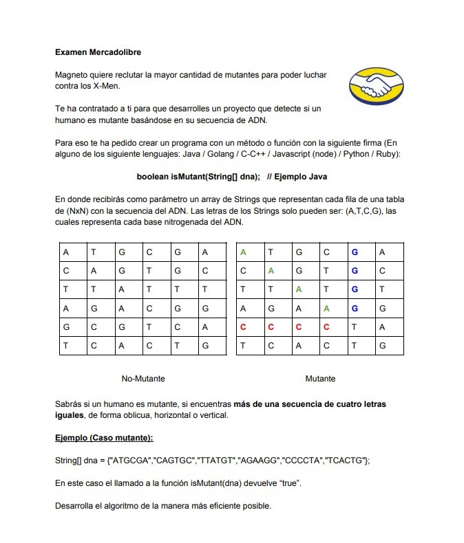

## PruebaML "Mutantes" exámen Mercadolibre.

El siguiente documento forma parte de la prueba examen “Mutantes” de Mercadolibre, la misma plantea un ejercicio explicado en la siguiente letra: 




#### Análisis
El ejercicio se centra en poder realizar la búsqueda de un mínimo de 2 ocurrencias de 4 letras iguales a la que llamaremos “patrón” o “patrones” que provienen de 4 diferentes tipos de  letras (A,C,T,G), se pueden considerar entonces 4 posibles patrones (AAAA,CCCC,TTTT,GGGG).
Se menciona que la matriz objetivo es de (N x N) por lo que en principio nuestra consideración es que puede crecer de dimensión siempre teniendo tantas filas como columnas. 
También relata que la dirección en que se pueden ubicar estos patrones es de forma horizontal, vertical y oblicua de modo que se deben recorrer las columnas, las filas y diagonales.
Para la realización del algoritmo de búsqueda primero estudiamos las tecnologías a utilizar, en nuestro caso particular hemos tomado las siguientes decisiones:<br/><br/>
Lenguaje de desarrollo: Java versión 1.8 (Permite la programación funcional, implementa las características de lambdas y streams que hacen posibles operaciones masivas con tiempos de ejecución más veloces y con menos líneas de código)<br/><br/>
##### Arquitectura: 
API REST desplegada en contenedor web y persistencia en BBDD no SQL.<br/><br/>
##### Sistema operativo: 
Windows Server 2012R2  (X64) – 2CPU Virtuales - 4Gb de RAM<br/><br/>
##### Servidor Web: 
[Apache Tomcat versión 8.5.69](https://tomcat.apache.org/download-80.cgi) <br/><br/>
##### Base de datos: 
[MongoDB 3.4](https://www.mongodb.com/try/download/community) (No es la última pero si la que soporta el server Windows Server 2012R2)<br/><br/>
##### IDE de desarrollo: 
Eclipse 2019-12.<br/><br/>
##### Herramientas: 
Postman Canary, JMeter, RESTful Stress, Enterprise Architect.<br/><br/>
##### Frameworks: 
Spring Boot, Apache Maven, JUnit, Surefire, Jacoco.<br/><br/>

#### Desarrollo
En una primera instancia se desarrolló el algoritmo teniendo en cuenta las siguientes consideraciones:
Dos instancias de patrones ya son suficientes para considerar a un candidato como “mutante” motivo por el cual en ese momento (si es que llega a dar la condición) abandonamos el recorrido para evitarnos el consumo del resto del algorítmo.
Generar la matríz es lo más costoso por lo que evitaremos este proceso mientras no sea absolutamente necesario.
Comenzaremos procesando el flujo de entrada tal como viene ya que este array son las filas donde ya tengo posibilidad de encontrar nuestros 2 patrones, las operaciones de búsqueda en casi todos los casos se realizan con streams con operaciones de filtrado, pattern match y collect.
El algoritmo va acumulando los matches de modo que si no hemos llegado a 2 ocurrencias con las filas proseguimos con las columnas, en este caso se realiza una operación de recupero y nuevamente hacemos un bulk processing con Streams en búsqueda de patrones.
Si para esta instancia no se han tenido ocurrencias se procede a generar la matríz para buscar las diagonales.
En el caso de las diagonales el algoritmo tiene en cuenta que el largo mínimo de una diagonal para poder obtener un match es de 4 caractéres motivo por el cual va a procesar desde las diagonales de mayor largo, recorriendo las derivadas hasta que sean de ese largo y abandona.
Otro aspecto que se tiene en cuenta es los casos en que la matríz tenga dimensiones iguales o mayores a 8 de lado en los que es posible más de 1 patrón igual por línea analizada. Para estos casos se activa una búsqueda extendida que permite, si se ha encontrado un patrón, se pueda analizar desde esa posición hacia adelante por una nueva ocurrencia ya que las búsquedas por expresiones regulares o las propias de la clase String no reconocen mas de 1 ocurrencia si se encuentran de forma adyacente, es decir uno a continuación del otro.
Para la persistencia el uso de MongoDB nos permite una fácil configuración, alto tiempo de respuesta y está disponible cross platform por lo que es muy versátil, nos valemos de la opción que provee el motor de utilizar el guardado en modo ```"Upsert"``` el cual realiza un update en caso de existir el registro o un insert en caso de no existir, validando automáticamente la no duplicidad de registros y cumpliendo de este modo con el requisito de almacenar solo 1 regístro por individuo.
MongoDB nos pide para tal fin que el registro tenga un id el cual generamos a partir de un Hash hexadecimal que es único por individuo a testear ya que se genera a partir del código del ADN evitando que si hay múltiples request de una misma secuencia estas sean almacenadas, se evaluó guardar los hashes de los request ya consultados en un HashTable para evitar la consulta al algorítmo pero se descartó en principio ya que sería necesario tener en memoria tantos hashes como objetos en la bbdd, quizás en un futuro se pueda avanzar en crear una caché de Hashes en otro componente externo o servicio que se pueda consultar antes de avanzar hacia el algorítmo.


#### Code Coverage
Se utilizaron 2 Herramientas de de code coverage, por un lado el plugin de JUnit para ir ejecutando y consultando en tiempo de desarrollo la cobertura de cada Test y por otro lado se adjunta el plugin Jacoco que está incluído en el pom del proyecto de modo que quien desee puede correrlo sin necesidad de un IDE de desarrollo, solo necesita tener instalado Maven y el servicio de MongoDB levantado (en nuestro caso la instalación utiliza los datos default de puerto 27017 y se agregaron los siguientes datos: usr:”admin”, pwd:”admin”, de todas formas es configurable desde el archivo src/main/resources/application.properties).
Para tal fin, ejecutar en el path raíz del proyecto donde se ubica el archivo pom el siguiente comando:<br/>
```"mvn clean test jacoco:report" ```  <br/> 
El reporte se generará en la carpeta target/site/Jacoco
Tener en cuenta que para ejecutar el reporte se debe cambiar dentro del pom en la siguiente entrada de Surefire
la opción ``` “<skipTests>true</skipTests>” por “<skipTests>false</skipTests>”``` de modo que quede así:
<br/>
```
<plugin>
  <groupId>org.apache.maven.plugins</groupId>
  <artifactId>maven-surefire-plugin</artifactId>
  <configuration>
	<skipTests>false</skipTests>
  </configuration>
</plugin>
```
Los resultados de las corridas se adjuntan en las siguientes imágenes:
##### Code Coverage
JUnit:<br/>
<br/><br/>
Jacoco:<br/>
<br/>

#### Vista General del sistema
##### Diagrama de clases:<br/><br/>
<br/><br/>

##### Validadores y Procesador:<br/><br/>
<br/><br/>

Jacoco:<br/>
<br/>


